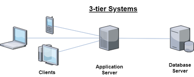
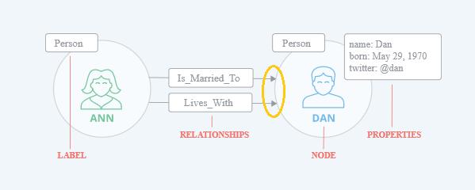

@snap[midpoint text-center]

## Database Concepts
####  A Historical Perspective

@snapend

Note:
- https://gitpitch.com/kk-sw/database-concepts/master?grs=github&t=moon#/
- Basic concepts - what's what
- Overview + common use cases 95%
- **No** database expert
- Personal bias

---

### Historical Databases (No Database)

- All data is stored in memory
- It's a start

✔ Fast

✔ Store anything in any format

✖ No persistent and durable storage

---

### Historical Databases (Flat File)

  ```text
  Ted Scott ▫ $100 ▫ Apple ☷ Ai Joe ▫ $900 ▫ Peach ☷
  ◺      ◿ │              │
    field   │              │
    value   │              └─ record separator
            └─ field separator
  ```

✔ Persistent

✔ Store anything (records can be different)

✖ Low-level access, programmer needed

✖ Complex queries are hard and slow

Note:
 - Still used for small data sets in some domains
 - Explain indexing

---

### Historical Databases (Hierarchical)

  ```text
         CTO
        ╱   ╲
      Head1 Head2
     ╱    ╲
   Mngr1  Mngr2
  ```

✔ Defined structure

✔ Faster than flat file

✖ Navigation through the hierarchy only (up-down)

✖ "Programmer perspective" needed

Note:
 - ~1960s
 - It's logical model
 - Actual disk storage is different
 - Domain databases: LDAP, Active Directory

---

### Historical Databases (Navigational)

  ```text
  John    ──  Alice ── Maggie   Rob
   │           │        │        │
  Richard ──  Scott    Susie ── Nancy
  ```

✔ Relaxed navigation

✔ Very fast

✖ Still pre-determined navigation (no ad hoc queries)

✖ "Programmer perspective" needed

Note:
- Still used - IBM Information Management System 1966 - v15 (2017)
- http://wiki.c2.com/?NetworkDatabase
- https://stackoverflow.com/questions/3422221/what-exactly-is-the-problem-with-hierarchal-and-network-models-of-databases
- NoSql relation

---

### Relational (RDBMS) Databases

@ul
- E. F. Codd in 1970 (IBM)
- Relational model of data
- Based on formal (math) rules
    - Optimal database design (NF)
    - Data access optimization
- User friendly
- Very popular
- MySQL, Oracle, MS SQL, Sybase, MS Access, etc.

@ulend

Note:
 - User friendly as abstractions and SQL

---

### RDBMS Concepts (Table)

- Database = tables + table cross-reference + keys


---

### RDBMS Concepts (Keys)

- Primary Key (PK) is an unique identifier for an entity
- Keys are needed to make relations


---

### Structured Query Language (SQL)

@ul
- SQL = Structured Query Language
- ANSI Standard
- Declarative language
    - Focus on what to do, not how to do
- User friendly
    - Abstractions for non-programmers
    - English like language
- Pure SQL applications (MS Access)
    - Not fancy, but no programming needed

@ulend

---

### Structured Query Language Examples (Table)

- Create table
    - CREATE TABLE families (f_name char, s_name char, child_count int);
- Delete table
    - DROP TABLE families;

Note:
 - Drop table = NoSql :)

---

### Structured Query Language Examples (Data)

- Insert new data
    - INSERT INTO families VALUES ("Philip", "Zimmer", 3);
- Query for data
    - SELECT f_name, s_name FROM families WHERE child_count > 2;
- Modify existing data
    - UPDATE families SET f_name ="Jonas" WHERE f_name = "Jhn"

---

### ACID (Transaction Control)

@ul
- Who sees what changes and when
- Transaction = operations in a bundle
- ACID (transaction control)
    - Atomic:       Operations succeed or roll-back (state before)
    - Consistent:   Database is in correct state when trans. finished
    - Isolated:     Transactions do not disturb/effect another
    - Durable:      Results are permanent, even if error'd
- 4 ACID levels
    - Speed vs consistency

@ulend

Note:
- Transaction with one operation
- Automatic ACID modes

---

### RDBMS Drawbacks



@ul
- Scaling is hard (ACID)
    - Expensive
    - 'Free' solutions are not mature for 9...9%
- Non-structured data is hard to store
    - NoSql for rescue
- For majority of uses SQL is just enough

@ulend

Note:
 - ACID -> math -> need to synchronize to guarantee correctness
 - Column stores


---


### NoSQL Databases

@ul
- Schema/structure definition is optional 
    - Store anything 
    - Mix data w/i collections
- Need to know major use cases before design
- Performance
    - Very good for expected use cases
    - Bad for unexpected use cases
- Varied transaction support (event-cons, quorum)  
- Query language complexities  
- **Scalable** distributed systems  

@ulend

Note:
- NoSql **wins**: (1) no schema  (2) scalability
- Navigational database (history)
- Query complexities: JSON -> SQL like
- NoI -> No Itron
- event-cons: eventual consistency

---

### CAP Theorem

@ul
- Eric Brewer (~1997)
- CAP theorem (Reliability)
  - Consistency:         A read receives the most recent data or an error
  - Availability:        A request receives a (non-error) response with (old) data
  - Partition tolerance: System operates when network is not reliable
- Choose two
- Most systems support configurable CAP modes

@ulend

---

### NoSQL Databases (Historical)

- XML Database
    - Wasteland
- Object Store
    - Programmer's database

Note:
 - XML - noman's land 
 - Object store

---

### NoSQL Databases (Key-Value)

  ```text
        123  ↠ firstName = "Arthur" ⌁ surName = "Legend" 
        8874 ↠ color     = "Black   ⌁ make    = "Ford"
  ```

- Very Fast
- Simple to use
- Access by keys only
- Infinispan, Redis, Memcached, Ignite, etc.

Note:
- Caches
- Mix storage
 
---

### NoSQL Databases (Document I.)

- Store JSON structured data
- Documents can have different fields

  ```text
    {                  ⌲ Document 1 Start   
      name: {          ⌲ Complex field   
        first: "John"  ⌲ Simple field
        last: "Const" 
      }
      birth: 
        "Jun 23, 1942"
    }                  ⌲ Document 1 End
    {                  ⌲ Document 2 Start
      fullName :       ⌲ Simple field
        "James Doe'
    }                  ⌲ Document 2 End
  ```

---

### NoSQL Databases (Document II.)

@ul
- Effective document (text) store
- Free-text search engine
- Documents are JSON based
- Various query format
- Varied transaction support (single doc.)
- Couchbase, MongoDB, etc.

@ulend

Note:
- MongoDB:   db.inventory.find( { status: "D" } )
- Couchbase: SELECT * FROM bucket JOIN ... WHERE email LIKE "%@example
- ACID on single documents, but not multi-document  
- easy to start with

---

### NoSQL Databases (Wide Column I.)

@ul
- Rows (key) with many (~1000) columns
- Write optimized (call logs, bank transactions, etc.)
- SQL like query language
- Limited ACID support 
- Heavy weight systems
- HBase, Cassandra, etc.

@ulend

Note:
- https://chase-seibert.github.io/blog/2013/04/26/hbase-schema-design.html#

---

### NoSQL Databases (Wide Column II.)


   
---

### NoSQL Databases (Graph I.)

- Based on directed graph
- Nodes, properties and relations !! 
- Replacement for complex relational models !!
- High level query language !! 
- ACID transactions 
- Neo4j (Cypher), GraphDB (SparQL), etc.

Note:
- https://neo4j.com/product/
- Cyper: MATCH (p:Person)<-[:LIKES]-(t:Technology)
- https://neo4j.com/developer/cypher-query-language/#_cypher_syntax
- https://neo4j.com/graphgist/first-steps-with-cypher
- https://db-engines.com/en/system/GraphDB%3BNeo4j
- SparQL: https://www.w3.org/TR/sparql11-overview/  

---

### NoSQL Databases (Graph II.)



---

### NoSQL Databases (Time)

- aa
- bb
- query
- transaction
- InfluxDB, Kdb+, Prometheus, etc.

---

### NoSQL Databases (Computing Grid)

- Calculations performed in a computing grid using data distribution
- Ignite, Infinispan, etc.

---

### NoSql Drawbacks

@ul
- Operational/developer expertise needed
- Complex Infrastructure
- Proposed usage drives database design
- Data de-normalization might be needed (!)
- ACID compliance varies
    - Performance impact     
- Complex queries can be hard  

@ulend

@snap[south text-center]
#### >> Distributed systems are hard <<
@snapend

---

### NoSql and RDBMS

  Term      |  NoSql     | RDBMS      
------------|------------|------------
Consistency | Weak       | Strong
Performance | Varies     | Good
Language    | Custom     | SQL
DevOps      | Complex    | Simpler
Node Count  |  >3        |  1
Scalability | Good       | Poor


---

@snap[midpoint text-center]

#### Use whatever is the best for the given problem

@snapend

Note:
- Mix Sql and NoSQL
- Show a chart with NoSQL, SQL, Cache

---

### A Distributed System Example


   

---

### Future Directions

@ul
- Hybrid     (NoSQL modes)
- NewSQL     (SQL ↔ NoSQL convergence)
- MAU        (commodity hardware)
- NIC/RDMA   (cross memory access)
- RAM store  (very fast)
- FPGA       (custom hardware)

@ulend

Note:
 - https://blog.acolyer.org/2017/11/23/kv-direct-high-performance-in-memory-key-value-store-with-programmable-nic/
 - RDMA – Remote Direct Memory Access


---

@snap[midpoint text-center]

## Thank You
#### Questions?

@snapend
